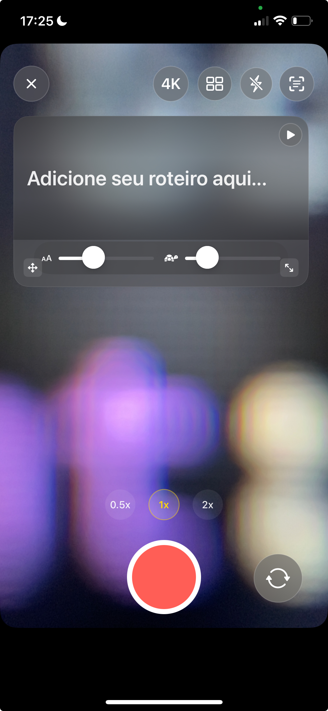
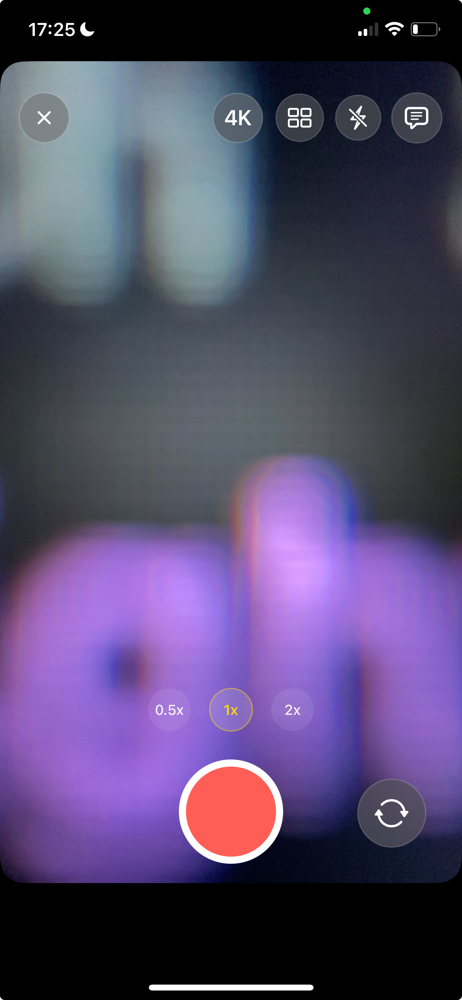

# 📱 Camera App - iOS Video Recording with Teleprompter
Because the default iOS camera sucks

[](https://swift.org)
[](https://developer.apple.com/ios/)
[](https://developer.apple.com/xcode/)
[](https://developer.apple.com/swiftui/)
[](https://developer.apple.com/av-foundation/)

A camera app that doesn't suck. Built with SwiftUI and AVFoundation because apparently nobody else thought to make a decent camera app for iOS. Features teleprompter, segmented recording, and filters that actually work.

## Preview

### Com Teleprompter


### Sem Teleprompter


---

## Features (the good stuff)

### Video Recording
- Segmented recording with thumbnails (because nobody wants to lose their work)
- HD/4K support with 30/60 FPS (because 24fps is for peasants)
- HEVC codec with H.264 fallback (Apple's way or the highway)
- Cinematic stabilization (because shaky footage is amateur hour)
- Zoom controls that actually work (0.5x/1x/2x + pinch)

### Camera Controls
- Manual focus and exposure (tap to focus, duh)
- Flash/torch support (hardware torch for rear, screen torch for front - yes, we're clever)
- Rule of thirds grid (optional, because composition matters)
- Dual camera support (front/back switching without the app crashing)
- Real-time filters: Rose, Mono, Noir, Chrome (not Instagram filters, actual filters)

### Teleprompter
- Floating overlay you can drag around (because fixed positions are for squares)
- Text editor that doesn't suck
- Auto-scroll with adjustable speed (because reading fast is a skill)
- Play/pause controls (basic stuff, but you'd be surprised)
- Integrates with recording (obviously)

### UI/UX
- SwiftUI interface with glass-morphism (because we're not savages)
- Gesture controls that make sense
- Responsive layout (works on different screen sizes, revolutionary concept)
- Accessibility support (because we're not monsters)

## Technical Stack (the boring stuff)

- SwiftUI (because UIKit is for boomers)
- AVFoundation (Apple's camera framework, because we're not reinventing the wheel)
- AVCaptureSession (manages the camera session, obviously)
- AVCaptureMovieFileOutput (records videos, who would've thought)
- Core Image (for filters that don't look like garbage)
- AVVideoComposition (video composition magic)
- Combine (reactive programming, because callbacks are for cavemen)
- UIKit Integration (UIView wrappers for camera preview, because SwiftUI doesn't do everything)

### Architecture (because we're not writing spaghetti code)
- `CameraViewModel` - Main app state (doesn't suck)
- `CaptureSessionController` - Camera session management (actually works)
- `SegmentedRecorder` - Multi-segment recording (because losing footage is amateur hour)
- `TeleprompterOverlay` - Floating teleprompter (you can drag it around)
- `TeleprompterViewModel` - Teleprompter logic (because separation of concerns)
- `GlassCompat` - Glass-morphism UI components (looks fancy)

## Requirements (the obvious stuff)

- Xcode 16.4+ (latest Xcode, because we're not supporting ancient versions)
- iOS 18.5+ (minimum deployment target, because iOS 12 is dead)
- Physical device (camera doesn't work in simulator, shocking I know)
- macOS 15.0+ (for development, because we're not masochists)

## Permissions (because Apple loves bureaucracy)

The project includes all necessary privacy keys in Info.plist:

- NSCameraUsageDescription (camera access, obviously)
- NSMicrophoneUsageDescription (audio recording, because silent videos are boring)
- NSPhotoLibraryAddUsageDescription (save videos to photo library)
- NSPhotoLibraryUsageDescription (read/select from photo library)

Videos are saved using "add-only" authorization when available (iOS 14+).

## Getting Started (the easy part)

1. Clone the repository
   ```bash
   git clone https://github.com/Pedroodelvalle/camera-swift.git
   cd camera-swift
   ```

2. Open in Xcode
   - Open `Camera.xcodeproj` in Xcode 16.4+
   - Select a physical device (camera doesn't work in simulator, remember?)
   - Build and run (⌘+R)

3. Grant Permissions (because Apple)
   - Allow camera access when prompted
   - Allow microphone access for video recording
   - Allow photo library access to save recordings

## User Interface & Controls (the fun stuff)

### Top Bar Controls
- Close Button (exits the app, revolutionary concept)
- HD/4K Toggle (30/60 FPS modes, because 24fps is for peasants)
- Grid Toggle (rule of thirds overlay, because composition matters)
- Flash/Torch (hardware torch for rear, screen torch for front - yes, we're clever)
- Teleprompter Toggle (opens teleprompter overlay, obviously)

### Camera Preview Gestures
- Single Tap (focus and exposure at tap point, because manual focus is for pros)
- Pinch Gesture (continuous zoom with smooth ramping, because jerky zoom is amateur hour)
- Double Tap (switch between front/rear cameras, because we're not savages)

### Bottom Controls
- Center: Quick zoom selectors (0.5x / 1x / 2x) and record button
- Left: Filter selector (None, Rose, Mono, Noir, Chrome)
- Right: Camera switcher and "Next" button (appears when segments are ready)

### Recording Features
- Segmented Recording with live timer display (because losing footage is amateur hour)
- Thumbnail Preview of recorded segments (visual feedback, who would've thought)
- Auto-concatenation when segments are ready for export (because manual editing is for masochists)

## Video Filters (because Instagram filters are garbage)

### Real-time Preview
- Light Overlay (visual indication during recording, because guessing is for amateurs)
- No Performance Impact (preview doesn't process live frames, because we're not stupid)
- Instant Feedback (see filter effect before recording, revolutionary concept)

### Export Processing
- Core Image Integration (professional-grade filter processing, because we're not using Instagram filters)
- AVVideoComposition (hardware-accelerated video composition, because CPU processing is for peasants)
- Available Filters: None (default), Rose, Mono, Noir, Chrome
- Post-processing (filters applied during final export only, because real-time processing kills performance)
- Photo Library Save (processed videos automatically saved, because manual saving is for masochists)

## Teleprompter Features 

### Activation & Editing
- Top Button Toggle (opens floating overlay interface, obviously)
- Text Editor (tap text to open full-screen editor, because small text editing is torture)
- Content Customization (edit, format, and manage script content, because flexibility matters)

### Playback Controls
- Play/Pause Button (located in top-right corner of overlay, because we're not savages)
- Auto-scroll (synchronized with recording workflow, because manual scrolling is amateur hour)
- Speed Control (adjustable scroll speed with compact sliders, because one speed fits all is garbage)
- Font Size (real-time font size adjustment, because reading small text is for masochists)

### Interface Interaction
- Drag Handle (bottom-left handle for moving overlay, because fixed positions are for squares)
- Resize Handle (bottom-right handle for resizing, because one size fits all is garbage)
- Floating Design (non-intrusive overlay that stays on top, because blocking the camera is amateur hour)
- Optional Pause (auto-pause at end of text content, because reading empty space is pointless)

## Technical Implementation (the nerdy stuff)

### Core Architecture
- SwiftUI + UIKit Hybrid (modern UI with `CameraPreviewView` (UIView) + `AVCaptureVideoPreviewLayer`, because SwiftUI doesn't do everything)
- MVVM Pattern (clean separation of concerns with ViewModels, because spaghetti code is for amateurs)
- Combine Framework (reactive programming for state management, because callbacks are for cavemen)

### Key Components
- `CaptureSessionController` (AV session management, because managing camera sessions manually is for masochists)
- `SegmentedRecorder` (multi-segment recording with `AVCaptureMovieFileOutput`, because losing footage is amateur hour)
- `CameraViewModel` (main coordinator integrating session, preview, and UI, because separation of concerns matters)
- `TeleprompterOverlay` & `TeleprompterViewModel` (floating overlay with editing, auto-scroll, drag/resize, speed/font controls)
- `GlassCompat` (modern glass-morphism styling for buttons and UI elements, because we're not savages)

## Topics & Keywords (for GitHub search optimization because i wanna be famous LOL)

**iOS Development**: SwiftUI, AVFoundation, iOS Camera, Video Recording, Mobile App Development

**Camera & Video**: Video Recording, Camera Controls, Zoom, Focus, Exposure, Flash/Torch, Video Filters, HEVC, H.264

**User Interface**: Teleprompter, Floating Overlay, Drag & Drop, Gesture Controls, Glass Design, Modern UI

**Technical**: Swift, Xcode, MVVM, Combine, Core Image, AVVideoComposition, Segmented Recording, Video Processing

**Professional Tools**: Content Creation, Video Production, Mobile Filmmaking, Professional Camera App

## Important Notes (the gotchas)

### Device-Specific Behavior
- Front Camera Torch (simulated using maximum screen brightness; restored when deactivated/closed, because front camera doesn't have real torch)
- Camera Switching (desired torch automatically reapplied when supported, because we're not savages)
- Grid Overlay (non-interactive, ignores touch events, because composition guides shouldn't interfere)
- Codec Preference (HEVC preferred with H.264 fallback when necessary, because Apple's way or the highway)
- Orientation (recorded videos maintain orientation via `preferredTransform`, because upside-down videos are amateur hour)

## Troubleshooting (when things go wrong)

### Common Issues
- "Privacy-sensitive data without a usage description" (verify privacy keys are present, see Permissions section)
- Torch not working in simulator (use a physical device for testing, because camera doesn't work in simulator)
- Build errors (ensure Xcode 16.4+ and iOS 18.5+ deployment target, because ancient versions are dead)
- Permission denied (check Info.plist privacy descriptions, because Apple loves bureaucracy)

### Performance Tips
- Use physical device for optimal camera performance (obviously)
- Close other camera apps before testing (because multiple camera apps are amateur hour)
- Ensure sufficient storage space for video recordings (because running out of space mid-recording is amateur hour)

## Optional: Snap Camera Kit Integration (because AR is cool)

The codebase includes conditional integrations with `SCSDKCameraKit` (disabled by default). To enable Snap AR effects:

1. Add Snap SDK to project (SPM/CocoaPods)
2. Configure credentials in `CameraViewModel`:
   ```swift
   snapApiToken = "your_snap_token"
   snapLensID = "your_lens_id"
   ```
3. Automatic behavior: Core Image filters are disabled when Snap AR is active (because conflicts are amateur hour)

## License

This project is available under the MIT License. See the [LICENSE](LICENSE) file for details.

## Contributing

Contributions are welcome! Please feel free to submit a Pull Request. For major changes, please open an issue first to discuss what you would like to change.

## Show Your Support

Give a ⭐ if this project helped you!

---

**Built with SwiftUI and AVFoundation (because we're not using React Native or Flutter for a camera app)**