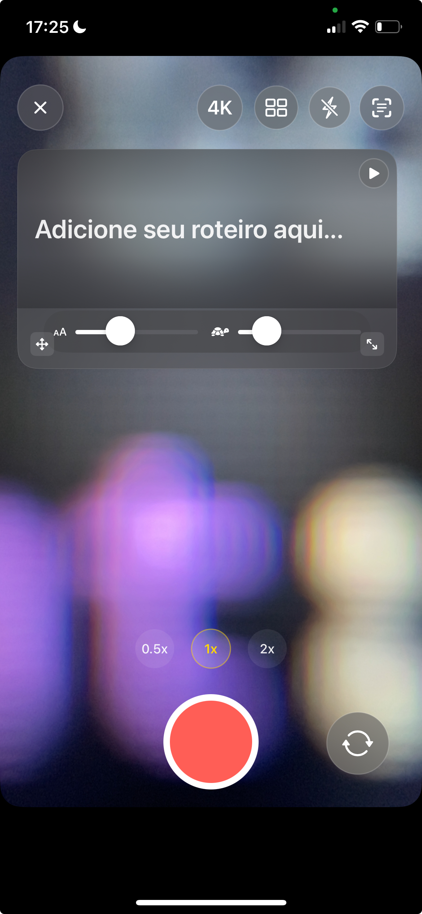
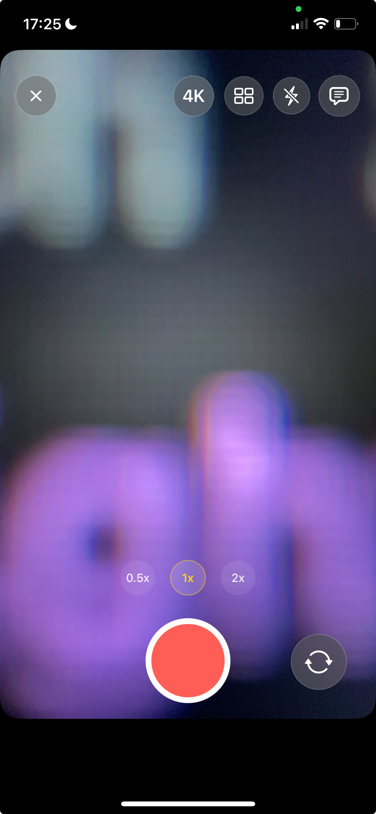
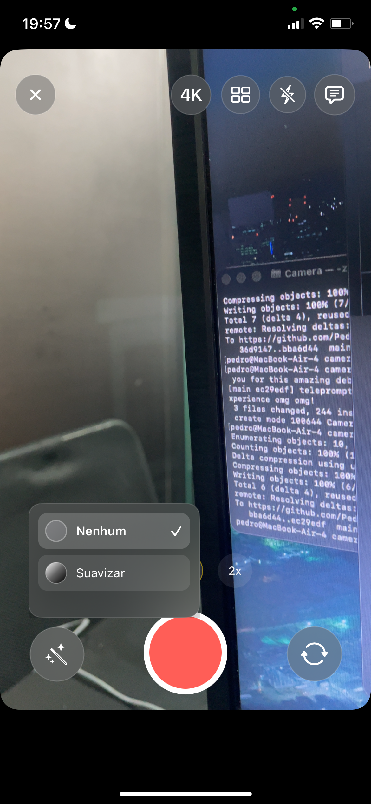
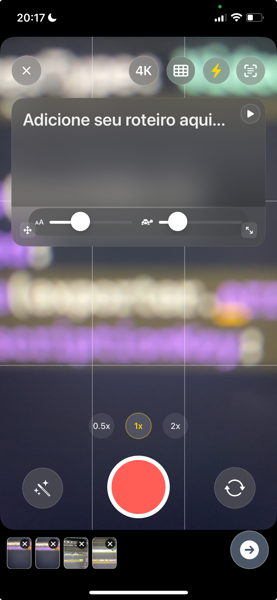

# Camera App - Because the default iOS camera sucks

[](https://swift.org)
[](https://developer.apple.com/ios/)
[](https://developer.apple.com/xcode/)

A camera app that doesn't suck. Built with SwiftUI and AVFoundation featuring teleprompter, segmented recording, and filters that actually work.

## Preview

 &nbsp;&nbsp;&nbsp;&nbsp; 

*Com Teleprompter | Sem Teleprompter*

&nbsp;

 &nbsp;&nbsp;&nbsp;&nbsp; 

*Live Filters | Segmented Takes*

## Features

- **Take Viewer** (visualize seus takes gravados com preview expandido)
- **Segmented Recording** with thumbnails (because nobody wants to lose their work)
- **Live Teleprompter** with drag & resize (because reading from paper is for cavemen)
- **Real-time Filters** (Rose, Mono, Noir, Chrome - not Instagram filters)
- **Professional Controls** (zoom, focus, exposure, flash/torch)
- **HEVC Recording** with H.264 fallback (Apple's way or the highway)
- **Cinematic Stabilization** (because shaky footage is amateur hour)

## Quick Start

1. **Clone & Open**
   ```bash
   git clone https://github.com/Pedroodelvalle/camera-swift.git
   cd camera-swift
   ```
   Open `Camera.xcodeproj` in Xcode 16.4+

2. **Run on Device** (camera doesn't work in simulator, shocking I know)
   - Select a physical device
   - Build and run (⌘+R)

3. **Grant Permissions** (because Apple)
   - Camera access for video recording
   - Microphone access for audio
   - Photo library access to save recordings

## Requirements

- Xcode 16.4+
- iOS 18.5+
- Physical device (camera features require hardware)

## Tech Stack

- **SwiftUI** (because UIKit is for boomers)
- **AVFoundation** (Apple's camera framework)
- **MVVM + Combine** (because spaghetti code is for amateurs)
- **Core Image** (for filters that don't look like garbage)

## Architecture

- `CameraViewModel` - Main app state
- `CaptureSessionController` - Camera session management
- `SegmentedRecorder` - Multi-segment recording
- `TeleprompterOverlay` - Floating teleprompter UI
- `GlassCompat` - Modern UI components

## Important Notes

- Front camera torch is simulated using screen brightness
- Grid overlay is non-interactive (ignores touch events)
- Videos maintain orientation via `preferredTransform`
- All processing happens locally (no cloud, because privacy matters)

## Troubleshooting

- **"Privacy-sensitive data"**: Check Info.plist privacy keys
- **Torch not working**: Use physical device (doesn't work in simulator)
- **Build errors**: Ensure Xcode 16.4+ and iOS 18.5+ deployment target

## License

MIT License - see [LICENSE](LICENSE) file.

---

**Built with SwiftUI and AVFoundation (because we're not using React Native or Flutter for a camera app)**