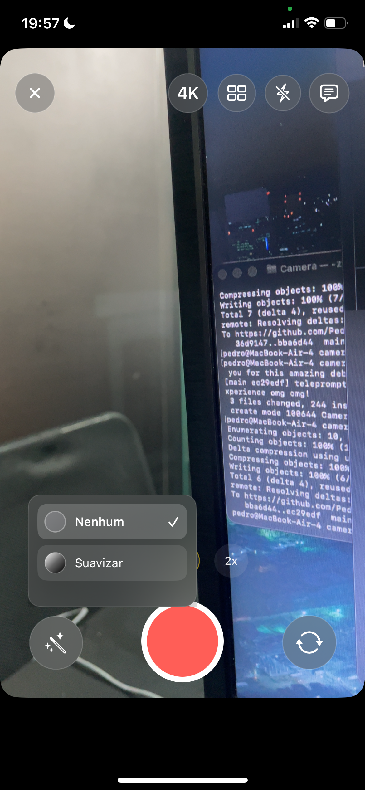
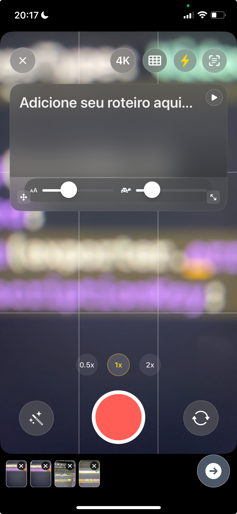

# Camera App - Porque a câmera padrão do iOS é uma merda

[](https://swift.org)
[](https://developer.apple.com/ios/)
[](https://developer.apple.com/xcode/)
[](https://developer.apple.com/swiftui/)
[](https://developer.apple.com/av-foundation/)

Um app de câmera que não é uma bosta. Feito com SwiftUI e AVFoundation porque aparentemente ninguém mais pensou em fazer um app de câmera decente para iOS. Tem teleprompter, gravação segmentada e filtros que funcionam de verdade.

## Preview

 &nbsp;&nbsp;&nbsp;&nbsp; 

*Com Teleprompter | Sem Teleprompter*

&nbsp;

 &nbsp;&nbsp;&nbsp;&nbsp; 

*Live Filters | Segmented Takes*

---

## Features (as coisas boas)

### Gravação de Vídeo
- Gravação segmentada com thumbnails (porque ninguém quer perder o trabalho)
- Suporte HD/4K com 30/60 FPS (porque 24fps é coisa de pobre)
- Codec HEVC com fallback H.264 (jeito da Apple ou tchau)
- Estabilização cinematográfica (porque vídeo tremido é coisa de amador)
- Controles de zoom que funcionam de verdade (0.5x/1x/2x + pinch)

### Controles de Câmera
- Foco e exposição manual (toque para focar, óbvio)
- Suporte flash/torch (torch hardware na traseira, torch de tela na frontal - sim, somos espertos)
- Grade regra dos terços (opcional, porque composição importa)
- Suporte dual camera (troca frente/trás sem o app crashar)
- Filtros em tempo real: Rose, Mono, Noir, Chrome (não filtros do Instagram, filtros de verdade)

### Teleprompter
- Overlay flutuante que você pode arrastar (porque posições fixas são coisa de quadrado)
- Editor de texto que não é uma bosta
- Auto-scroll com velocidade ajustável (porque ler rápido é uma habilidade)
- Controles play/pause (coisa básica, mas você ia se surpreender)
- Integra com a gravação (óbvio)

### UI/UX
- Interface SwiftUI com glass-morphism (porque não somos selvagens)
- Controles gestuais que fazem sentido
- Layout responsivo (funciona em tamanhos diferentes de tela, conceito revolucionário)
- Suporte a acessibilidade (porque não somos monstros)

## Stack Técnico (as coisas chatas)

- SwiftUI (porque UIKit é coisa de boomer)
- AVFoundation (framework de câmera da Apple, porque não vamos reinventar a roda)
- AVCaptureSession (gerencia a sessão da câmera, óbvio)
- AVCaptureMovieFileOutput (grava vídeos, quem diria)
- Core Image (para filtros que não parecem lixo)
- AVVideoComposition (mágica de composição de vídeo)
- Combine (programação reativa, porque callbacks são coisa de homem das cavernas)
- Integração UIKit (wrappers UIView para preview da câmera, porque SwiftUI não faz tudo)

### Arquitetura (porque não estamos escrevendo código espaguete)
- `CameraViewModel` - Estado principal do app (não é uma bosta)
- `CaptureSessionController` - Gerenciamento de sessão da câmera (funciona de verdade)
- `SegmentedRecorder` - Gravação multi-segmento (porque perder filmagem é coisa de amador)
- `TeleprompterOverlay` - Teleprompter flutuante (você pode arrastar)
- `TeleprompterViewModel` - Lógica do teleprompter (porque separação de responsabilidades)
- `GlassCompat` - Componentes UI glass-morphism (fica chique)

## Requisitos (as coisas óbvias)

- Xcode 16.4+ (Xcode mais recente, porque não vamos suportar versões antigas)
- iOS 18.5+ (deployment target mínimo, porque iOS 12 está morto)
- Dispositivo físico (câmera não funciona no simulador, chocante eu sei)
- macOS 15.0+ (para desenvolvimento, porque não somos masoquistas)

## Permissões (porque a Apple ama burocracia)

O projeto inclui todas as chaves de privacidade necessárias no Info.plist:

- NSCameraUsageDescription (acesso à câmera, óbvio)
- NSMicrophoneUsageDescription (gravação de áudio, porque vídeos silenciosos são chatos)
- NSPhotoLibraryAddUsageDescription (salvar vídeos na biblioteca de fotos)
- NSPhotoLibraryUsageDescription (ler/selecionar da biblioteca de fotos)

Vídeos são salvos usando autorização "add-only" quando disponível (iOS 14+).

## Começando (a parte fácil)

1. Clone o repositório
   ```bash
   git clone https://github.com/Pedroodelvalle/camera-swift.git
   cd camera-swift
   ```

2. Abra no Xcode
   - Abra `Camera.xcodeproj` no Xcode 16.4+
   - Selecione um dispositivo físico (câmera não funciona no simulador, lembra?)
   - Build e run (⌘+R)

3. Conceda Permissões (porque Apple)
   - Permita acesso à câmera quando solicitado
   - Permita acesso ao microfone para gravação de vídeo
   - Permita acesso à biblioteca de fotos para salvar gravações

## Interface e Controles (as coisas legais)

### Controles da Barra Superior
- Botão Fechar (sai do app, conceito revolucionário)
- Toggle HD/4K (modos 30/60 FPS, porque 24fps é coisa de pobre)
- Toggle Grade (overlay regra dos terços, porque composição importa)
- Flash/Torch (torch hardware na traseira, torch de tela na frontal - sim, somos espertos)
- Toggle Teleprompter (abre overlay do teleprompter, óbvio)

### Gestos no Preview da Câmera
- Toque Simples (foco e exposição no ponto do toque, porque foco manual é coisa de pro)
- Gesture Pinch (zoom contínuo com ramping suave, porque zoom trêmulo é coisa de amador)
- Toque Duplo (troca entre câmeras frontal/traseira, porque não somos selvagens)

### Controles Inferiores
- Centro: Seletores de zoom rápido (0.5x / 1x / 2x) e botão de gravar
- Esquerda: Seletor de filtros (None, Rose, Mono, Noir, Chrome)
- Direita: Alternador de câmera e botão "Próximo" (aparece quando segmentos estão prontos)

### Recursos de Gravação
- Gravação Segmentada com timer ao vivo (porque perder filmagem é coisa de amador)
- Preview de Thumbnail dos segmentos gravados (feedback visual, quem diria)
- Auto-concatenação quando segmentos estão prontos para export (porque edição manual é coisa de masoquista)

## Filtros de Vídeo (porque filtros do Instagram são lixo)

### Preview em Tempo Real
- Overlay Leve (indicação visual durante a gravação, porque adivinhar é coisa de amador)
- Sem Impacto na Performance (preview não processa frames ao vivo, porque não somos burros)
- Feedback Instantâneo (veja o efeito do filtro antes de gravar, conceito revolucionário)

### Processamento de Export
- Integração Core Image (processamento de filtros de nível profissional, porque não estamos usando filtros do Instagram)
- AVVideoComposition (composição de vídeo acelerada por hardware, porque processamento de CPU é coisa de pobre)
- Filtros Disponíveis: None (padrão), Rose, Mono, Noir, Chrome
- Pós-processamento (filtros aplicados apenas durante o export final, porque processamento em tempo real mata a performance)
- Salvamento na Biblioteca de Fotos (vídeos processados salvos automaticamente, porque salvamento manual é coisa de masoquista)

## Recursos do Teleprompter (porque ler papel é coisa de homem das cavernas)

### Ativação e Edição
- Toggle Botão Superior (abre interface de overlay flutuante, óbvio)
- Editor de Texto (toque no texto para abrir editor tela cheia, porque edição de texto pequeno é tortura)
- Customização de Conteúdo (edite, formate e gerencie conteúdo do script, porque flexibilidade importa)

### Controles de Reprodução
- Botão Play/Pause (localizado no canto superior direito do overlay, porque não somos selvagens)
- Auto-scroll (sincronizado com workflow de gravação, porque scroll manual é coisa de amador)
- Controle de Velocidade (velocidade de scroll ajustável com sliders compactos, porque uma velocidade serve todos é lixo)
- Tamanho da Fonte (ajuste de tamanho da fonte em tempo real, porque ler texto pequeno é coisa de masoquista)

### Interação da Interface
- Handle de Arrastar (handle inferior esquerdo para mover overlay, porque posições fixas são coisa de quadrado)
- Handle de Redimensionar (handle inferior direito para redimensionar, porque um tamanho serve todos é lixo)
- Design Flutuante (overlay não intrusivo que fica no topo, porque bloquear a câmera é coisa de amador)
- Pausa Opcional (auto-pausa no final do conteúdo de texto, porque ler espaço vazio é inútil)

## Implementação Técnica (as coisas nerds)

### Arquitetura Principal
- Híbrido SwiftUI + UIKit (UI moderna com `CameraPreviewView` (UIView) + `AVCaptureVideoPreviewLayer`, porque SwiftUI não faz tudo)
- Padrão MVVM (separação limpa de responsabilidades com ViewModels, porque código espaguete é coisa de amador)
- Framework Combine (programação reativa para gerenciamento de estado, porque callbacks são coisa de homem das cavernas)

### Componentes Principais
- `CaptureSessionController` (gerenciamento de sessão AV, porque gerenciar sessões de câmera manualmente é coisa de masoquista)
- `SegmentedRecorder` (gravação multi-segmento com `AVCaptureMovieFileOutput`, porque perder filmagem é coisa de amador)
- `CameraViewModel` (coordenador principal integrando sessão, preview e UI, porque separação de responsabilidades importa)
- `TeleprompterOverlay` & `TeleprompterViewModel` (overlay flutuante com edição, auto-scroll, arrastar/redimensionar, controles de velocidade/fonte)
- `GlassCompat` (componentes UI glass-morphism, fica chique)

## Topics & Keywords (para otimização de busca no GitHub porque eu quero ficar famoso LOL)

**Desenvolvimento iOS**: SwiftUI, AVFoundation, Câmera iOS, Gravação de Vídeo, Desenvolvimento de App Mobile

**Câmera e Vídeo**: Gravação de Vídeo, Controles de Câmera, Zoom, Foco, Exposição, Flash/Torch, Filtros de Vídeo, HEVC, H.264

**Interface do Usuário**: Teleprompter, Overlay Flutuante, Drag & Drop, Controles Gestuais, Design Glass, UI Moderna

**Técnico**: Swift, Xcode, MVVM, Combine, Core Image, AVVideoComposition, Gravação Segmentada, Processamento de Vídeo

**Ferramentas Profissionais**: Criação de Conteúdo, Produção de Vídeo, Cinema Mobile, App de Câmera Profissional

## Notas Importantes (as pegadinhas)

### Comportamento Específico do Dispositivo
- Torch da Câmera Frontal (simulado usando brilho máximo da tela; restaurado quando desativado/fechado, porque câmera frontal não tem torch real)
- Troca de Câmera (torch desejado automaticamente reaplicado quando suportado, porque não somos selvagens)
- Overlay da Grade (não interativo, ignora eventos de toque, porque guias de composição não devem interferir)
- Preferência de Codec (HEVC preferido com fallback H.264 quando necessário, porque jeito da Apple ou tchau)
- Orientação (vídeos gravados mantêm orientação via `preferredTransform`, porque vídeos de cabeça para baixo são coisa de amador)

## Troubleshooting (quando as coisas dão errado)

### Problemas Comuns
- "Privacy-sensitive data without a usage description" (verifique se as chaves de privacidade estão presentes, veja seção Permissões)
- Torch não funciona no simulador (use um dispositivo físico para teste, porque câmera não funciona no simulador)
- Erros de build (certifique-se de Xcode 16.4+ e deployment target iOS 18.5+, porque versões antigas estão mortas)
- Permissão negada (verifique descrições de privacidade no Info.plist, porque a Apple ama burocracia)

### Dicas de Performance
- Use dispositivo físico para performance otimizada da câmera (óbvio)
- Feche outros apps de câmera antes de testar (porque múltiplos apps de câmera são coisa de amador)
- Certifique-se de ter espaço de armazenamento suficiente para gravações de vídeo (porque ficar sem espaço no meio da gravação é coisa de amador)

## Opcional: Integração Snap Camera Kit (porque AR é legal)

O codebase inclui integrações condicionais com `SCSDKCameraKit` (desabilitado por padrão). Para habilitar efeitos AR do Snap:

1. Adicione Snap SDK ao projeto (SPM/CocoaPods)
2. Configure credenciais no `CameraViewModel`:
   ```swift
   snapApiToken = "your_snap_token"
   snapLensID = "your_lens_id"
   ```
3. Comportamento automático: Filtros Core Image são desabilitados quando Snap AR está ativo (porque conflitos são coisa de amador)

## Licença

Este projeto está disponível sob a Licença MIT. Veja o arquivo [LICENSE](LICENSE) para detalhes.

## Contribuindo

Contribuições são bem-vindas! Sinta-se à vontade para enviar um Pull Request. Para mudanças maiores, por favor abra uma issue primeiro para discutir o que você gostaria de mudar.

## Mostre Seu Apoio

Dê uma ⭐ se este projeto te ajudou!

---

**Feito com SwiftUI e AVFoundation (porque não estamos usando React Native ou Flutter para um app de câmera)**
